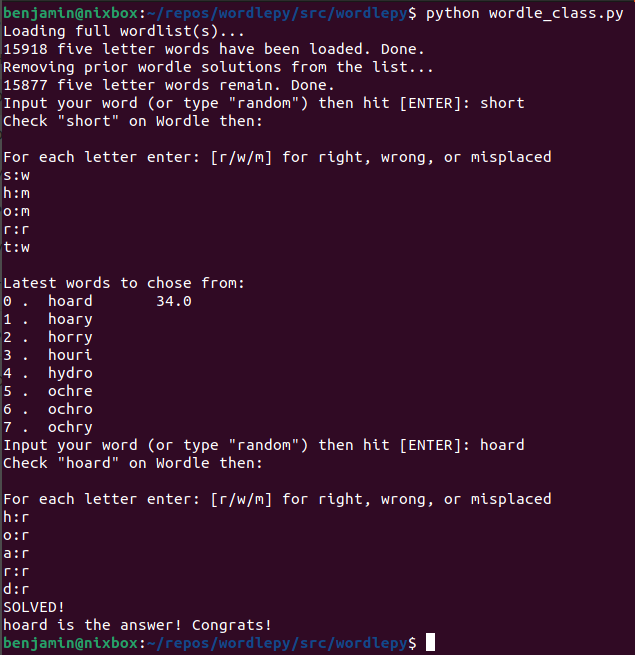
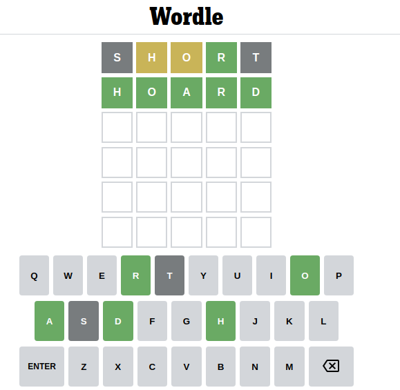
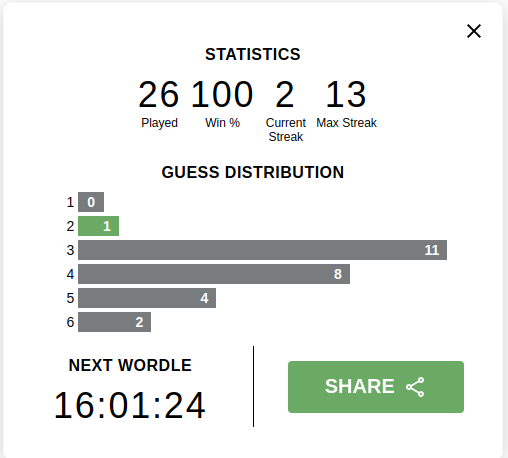

# wordlepy
python wordle utilities: word suggestions - autosolver - wordle simulator

(we called it wordlepy since pywordle was taken on pypi)

## Screenshots

- Example run:





- Winning stats from using this tool:



## Install

- via github:
```sh
$ git clone https://github.com/benahook/wordlepy.git
$ cd wordlepy
$ pip install -r requirements.txt```
```
- via pip
```sh
$ pip install wordlepy
```

## Usage

```sh
$ cd wordlepy/src
$ python3 wordle_class.py
$ python3 wordlebot.py
```
Or if you installed via PIP:
```sh
$ python -m wordlepy.wordle_class
$ python -m wordlepy.wordlebot
```
An optional Windows built .exe will be availble shortly as well.

## Description
The program will walk you through the steps for solving a wordle by process
of elimination. 

The *full* English language word list is loaded from "words_alpha.txt"
This was pulled from:
[https://raw.githubusercontent.com/dwyl/english-words/master/words_alpha.txt](https://raw.githubusercontent.com/dwyl/english-words/master/words_alpha.txt)

The frequency list was pulled from
[frequencylist.com](http://frequencylist.com)

So far, every wordle solution we've found has been present on this word list. 

*HOWEVER*

Not all wordle solutions have had a frequency associated on the frequency list here.
Because of this, we only display a words relative frequency IF it has one. 

This number should be used to help the user make good guesses (since most wordle words are semi common) (besides tacit of course. WTH was that?)

## Disclaimer
This code has no affiliation to wordle or any of the companies that own said game. 
If using this program negatively affects your streaks/stats/experience/well-being... We're sorry. Maybe don't use it?

If using this program positively affects your experience... Awesome! Just don't pretend to be a braniac and post all over your socials about it. 

enjoy. 

## Contributing
Please do! This is just a starting point and could use some serious work/development!
All comments/questions/concerns are welcomed.

## Contact
[benahook@gmail.com](mailto:benahook@gmail.com)
